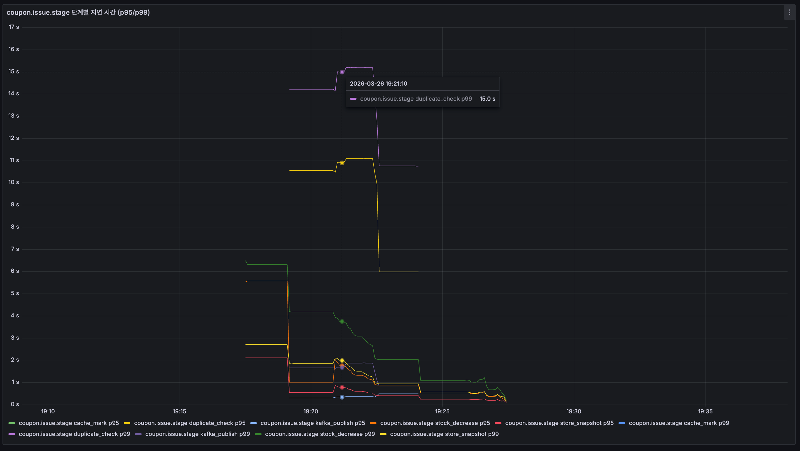
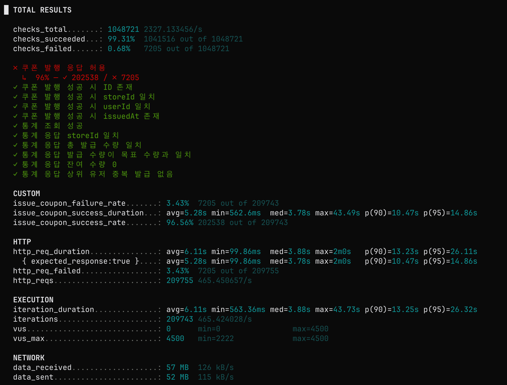
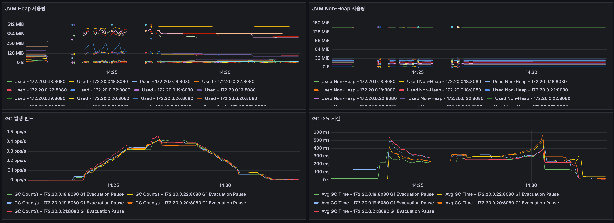
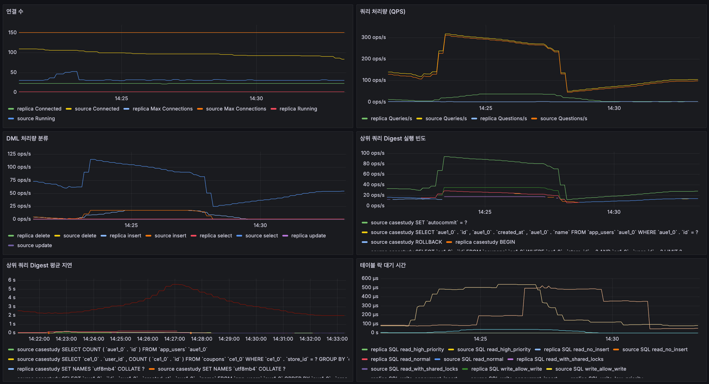
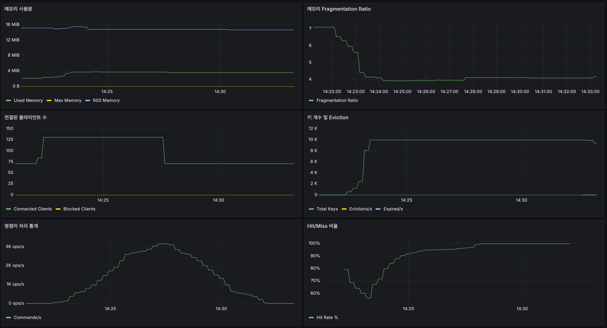
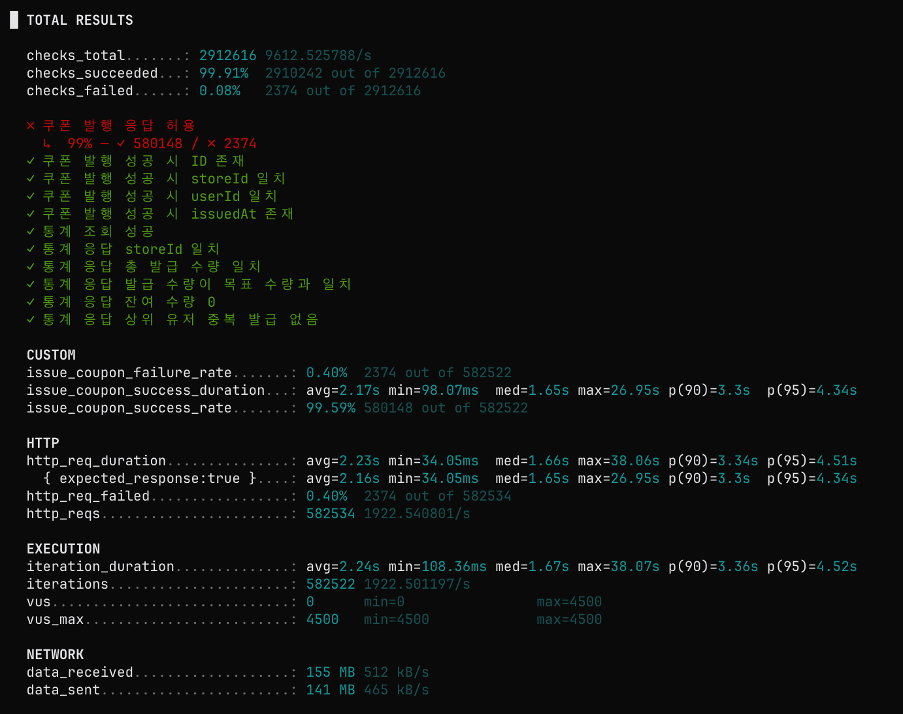
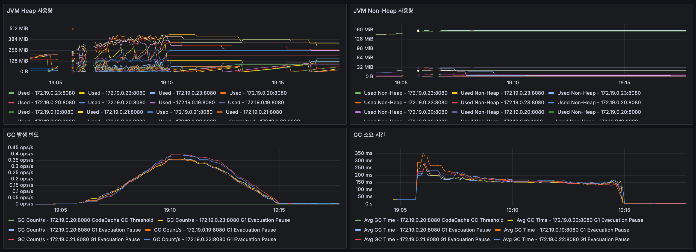
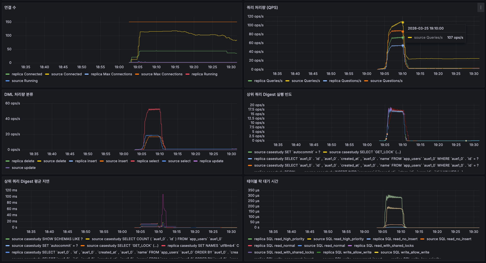
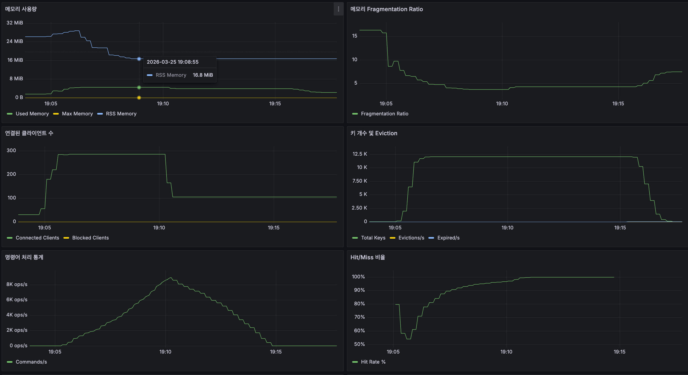

# 쇼핑몰 실시간 라이브 방송 - 쿠폰 발행 시나리오 

이 시나리오는 쇼핑몰 라이브 방송에서 사용자가 쿠폰 발행 버튼을 눌렀을 때, 쿠폰이 발행되는 과정을 시뮬레이션한다. 

- 가정
  - 사용자 수 : 20000명
  - 쿠폰 발행량 : 5000개
  - 인당 발행 제한 : 1개
  - 목표 응답 시간 : 500ms
  - 목표 QPS : 4500 req/s

[비관적락 테스트](#비관적-락-테스트-결과)를 진행했을 때 목표 QPS인 `4500 req/s`에 크게 못 미치는 결과가 나와서 이를 해결하기 위해서 Redis 락을 도입했다. 동일 유저 중복 조회 방지, Coupon 개수 정합성, 상점 이벤트 정보와 유저 정보 등을 Cache Aside 했음에도 목표 QPS 달성에는 실패했다. 

심지어 Redisson에서 Netty Connection Pool이 고갈되는 현상까지 겹치면서 쿠폰 정합성이 맞지 않는 버그도 함께 발생했다. 이 시점에는 실제로 서로 다른 두 종류의 문제가 동시에 존재했다.

첫 번째 문제는 `CouponRepository.save()` 이후 Redis에 해당 유저의 발급 여부를 기록하는 흐름이 하나의 트랜잭션으로 묶여 있지 않았다는 점이다. 그 결과 `save()`는 성공했지만 Redis 기록 단계에서 예외가 발생하면 fallback 로직이 실행되면서 DB에는 쿠폰이 저장됐는데 Redis에는 발급 기록이 남지 않는 상태가 생길 수 있었다. 즉 DB와 Redis 사이의 정합성이 깨질 수 있는 구조였다. 이 문제는 이후 `save + markCouponIssued`를 하나의 트랜잭션 경계로 묶으면서 해결했다.

두 번째 문제는 초기 재고 적재 구간의 락 만료 경쟁 조건이었다. 처음에는 같은 유저에 대한 중복 발급을 의심했지만, `storeId + userId` 기준으로 집계했을 때 `count > 1`인 유저가 확인되지 않아 원인을 다시 추적했다. 조사 결과 동일 유저 중복 발급보다는 Redis에 남은 쿠폰 수량을 최초 적재하는 `initializeRemainingStockIfAbsent()` 구간에서 경쟁 조건이 발생했을 가능성이 더 컸다. 당시 구현은 고정 lease time 기반 락을 사용하고 있었는데, 이 락이 작업 중간에 만료되면 다른 트랜잭션이 아직 critical section 안에 남아 있는 상황에서도 다시 초기화 로직에 진입할 수 있었다. 그 사이 재고가 `1000`으로 재적재된 뒤 각 요청이 다시 `-1` 감소를 수행하면서, 실제보다 더 많은 재고가 남아 있는 것처럼 측정되는 문제가 생겼다. 서로 다른 시점의 `issuedCount`를 기준으로 남은 재고가 중복 계산되거나 더 오래된 값이 마지막에 덮어써지면서 초과 발급 위험까지 커졌다. 이 문제는 [고정 lease time 대신 watchdog 기반 락으로 전환하고 unlock 시 현재 스레드 보유 여부를 확인하는 변경](https://github.com/rookedsysc/case-study/pull/3/changes/130f0cf0e17f1fbecf0c457df6603bc5555b0033)으로 완화했다.

즉 이 이슈는 단순한 중복 발급 문제가 아니라, DB와 Redis 기록 경계의 정합성 문제와 재고 캐시 초기화 시점의 동시성 제어 실패가 결합된 복합 장애였다. 그래서 이후에는 [문제를 근본적으로 해결하면서 Redisson 최적화를 함께 시도](https://github.com/rookedsysc/case-study/pull/10/changes)했다.

Redis 캐시와 Redis 락을 도입한 뒤에도 목표 QPS에는 여전히 도달하지 못했다. 관측 결과 source DB의 `Questions/s`는 여전히 약 `300 ops/s` 수준이었고, `1 Core / 1 GB` 인스턴스가 지속적으로 감당하기에는 부담이 있는 수치였다. 특히 사용자 정보가 캐시에 없을 때의 최초 조회 비용과, 쿠폰 발급 시점마다 발생하는 DB 저장 비용이 병목으로 남아 있었다. 즉 Redis를 앞단에 두어 읽기와 경쟁 제어를 일부 완화했더라도, 최종 쓰기 경로가 여전히 요청 처리 시간 안에 남아 있으면 처리량 개선에는 한계가 있었다.

그래서 이후에는 CQRS 관점으로 읽기와 쓰기 경로를 더 분리하고, Replica DB 2대를 두어 조회 부하를 분산하는 한편, 쿠폰 저장은 Kafka 기반 Event Streaming으로 비동기화하는 방향을 선택했다. 이 구조의 핵심 목적은 요청-응답 경로에서 가장 비싼 DB write를 제거해 응답 시간을 줄이고, source DB가 순간적인 몰림을 직접 흡수하지 않도록 완충 지점을 두는 것이었다. Redis는 선착순 재고 차감과 중복 발급 제어를 담당하고, Kafka는 발급 이벤트를 안전하게 뒤로 전달하며, consumer는 순차적으로 DB 저장을 처리하는 식으로 역할을 분리했다.

다만 이 구조는 Redis 상태 변경과 Kafka 발행이 하나의 원자적 성공으로 묶이지 않기 때문에, 중간 단계의 실패를 어떻게 다룰지가 중요했다. 실제로 [commit의 한 변경](https://github.com/rookedsysc/case-study/pull/3/changes/dc55a41def34db6030edb4be05d54b7aa98b7c5a)에서는 이벤트 발행 전 검증이 충분하지 않아 발행 실패가 발생할 수 있었고, 그 경우 쿠폰 이벤트는 Kafka로 전달되지 못했는데 Redis에는 이미 발급 count가 올라간 상태가 남는 문제가 드러났다. 즉 요청 경로의 성능은 개선됐지만, 발행 실패를 보상하지 않으면 선착순 재고 상태와 실제 저장 결과 사이에 불일치가 생길 수 있다는 점이 확인된 것이다. 이후에는 발행 전 검증을 보강하고, 이벤트 발행이 실패하면 Redis count를 되돌리는 보상 로직을 추가해 이 정합성 문제를 해결했다.

이 과정에서 가장 많이 고민한 지점은 중복 발급 검증을 producer 단계에서 할지, consumer 단계에서 할지였다. consumer에서 중복 여부를 최종 판별하면 producer는 더 단순해지지만, 이미 재고를 차감한 뒤 뒤늦게 중복 요청임이 드러날 수 있다. 그러면 중복 요청마다 재고를 다시 복구해야 하고, 그 사이에 다른 사용자가 받아야 할 선착순 슬롯이 잠시 점유되었다가 반환되는 흐름이 생긴다. 이런 구조는 "모든 사용자가 동일한 기준으로 선착순 기회를 가진다"는 요구사항과 잘 맞지 않았고, 불필요한 보상 처리와 추가 I/O도 유발한다.

반대로 producer에서 먼저 재고 차감과 중복 검증을 수행하고, 검증을 통과한 요청만 이벤트로 발행하면 선착순 판단 기준을 요청 진입 시점에 최대한 가깝게 둘 수 있다. 중복 요청은 초기에 차단되므로 불필요한 Kafka 메시지와 DB write를 줄일 수 있고, 당첨되지 못한 요청 때문에 재고를 다시 복구하는 보상 흐름도 크게 줄어든다. 물론 이 방식은 producer에서 Redis 상태를 먼저 갱신하고, 이후 Kafka 발행이나 consumer 저장 실패 시 이를 되돌리는 보상 로직이 필요하다는 부담이 있다. 그럼에도 이 케이스에서는 선착순 공정성과 전체 리소스 효율을 더 중요하게 봤기 때문에, 검증은 producer에서 수행하고 consumer는 저장과 실패 보상에 집중하는 방향이 더 적절하다고 판단했다.

목표 QPS에 도달하지 못했기 때문에 좀 더 병목을 해소할 수 있는 부분을 찾고자 했다. Otel Timer를 붙여서 각 구간별로 응답 속도가 어느정도 되는지 측정을 했고 사용자가 실제로 있는 사용자인지, 중복 사용자인지 검증하는 부분에서 병목이 많이 발생하는걸 알게 되었다. 
JWT를 사용하는 경우 JWT를 신뢰할 수 있다는 전제하에 실제로 사용자가 있는지 검증할 필요가 없다고 생각했다. 그래서 사용자를 검증하는 부분은 제거하고 중복 발급 로직만 좀 더 보강해보기로 했다. 

## 비관적 락 테스트 결과

비관적 락 시나리오에서는 목표 QPS인 `4500 req/s`에 크게 못 미쳤고, 요청이 DB 구간에서 직렬화되면서 전체 처리량과 응답 시간이 빠르게 악화됐다.

### 결과 요약

- k6 기준 전체 요청 처리량은 약 `147.58 req/s`였고, 목표 QPS `4500 req/s` 대비 약 `3.3%` 수준에 머물렀다.
- iteration 처리량도 `147.56 it/s` 수준으로, 높은 동시성을 걸어도 실제 처리량이 거의 늘어나지 않았다.
- `issue_coupon_success_rate`는 `90.03%`였지만 `http_req_duration p(95)`는 `51.97s`, `issue_coupon_success_duration p(95)`는 `54.05s`로 목표 응답 시간 `500ms`를 크게 초과했다.
- 실패율은 `9.96%`였고, `쿠폰 발행 응답 허용` 체크도 `61,382 / 68,176`만 통과했다.
- JVM Heap은 인스턴스별로 대체로 `128MiB` 이하에서 유지됐고, 일부 인스턴스만 약 `256~320MiB` 수준까지 사용했다. GC 빈도는 높지 않았으며 평균 GC 시간도 대체로 `100~260ms` 범위에 머물렀다.
- DB는 replica보다 source에 부하가 집중됐고, source `Questions/s`가 최대 약 `1.57K ops/s`까지 상승했다. 상위 digest와 DML 분류를 보면 `coupons`, `stores`, `app_users` 조회가 반복되며 source select가 최대 `800 ops/s` 이상까지 치솟았다.
- 테이블 락 대기 시간은 source 기준 최대 약 `450us` 수준으로 아주 길지는 않았지만, 락 자체보다 반복적인 조회와 직렬화된 처리 경로가 병목으로 보였다.

### 관찰 이미지

> k6 최종 결과 화면이다. 전체 요청 처리량이 약 `147.58 req/s`에 머물고 `http_req_duration p(95)`가 `51.97s`까지 올라가면서, 목표 QPS `4500 req/s`와 목표 응답 시간 `500ms`를 모두 만족하지 못한 것을 보여준다.

> 애플리케이션 JVM 메트릭 화면이다. Heap과 Non-Heap 사용량은 전체적으로 안정적이고 GC 빈도도 높지 않아서, 이 시나리오의 주된 병목이 JVM 메모리 압박보다는 다른 구간에 있음을 시사한다.

> source DB에 연결과 쿼리가 집중되고 `coupons`, `stores`, `app_users` 관련 조회가 반복적으로 증가하면서, 비관적 락 기반 처리에서 DB 직렬화 비용이 병목으로 작용했음을 보여준다.

### 해석

비관적 락은 메모리나 GC보다 DB 중심의 동시성 제어 비용이 더 크게 드러났다. 애플리케이션 자체가 메모리 압박으로 무너진 것은 아니지만, source DB에 쿼리와 락 관련 작업이 몰리면서 요청 하나당 대기 시간이 길어졌고, 그 결과 전체 QPS와 응답 시간이 모두 목표 수준에 도달하지 못했다.

## Redis 락 테스트 결과

Redis 락 시나리오에서는 비관적 락 대비 처리량이 크게 늘었고, DB와 Redis 모두 비교적 안정적인 사용량 범위를 유지했다. 특히 MySQL 연산량이 눈에 띄게 줄어든 반면, Redis는 안정적인 메모리 사용량 안에서 캐시와 락 처리량을 감당했다.

### 결과 요약

- k6 기준 전체 요청 처리량은 약 `465.45 req/s`였고, 비관적 락의 `147.58 req/s` 대비 약 `3.15배` 증가했다.
- `issue_coupon_success_duration avg`는 `17.82s`에서 `5.28s`로 줄어 약 `3.37배` 개선됐고, 응답 시간 지표 전반도 비관적 락 대비 뚜렷하게 감소했다.
- `http_req_duration p(95)`는 `51.97s`에서 `26.11s`로 낮아졌고, `issue_coupon_success_duration p(95)`도 `54.05s`에서 `14.86s`로 크게 줄었다.
- `issue_coupon_success_rate`는 `96.56%`, 실패율은 `3.43%`로 비관적 락 대비 안정성이 함께 개선됐다.
- MySQL source `Questions/s`는 비관적 락의 최대 약 `1.57K ops/s`에서 Redis 락에서는 최대 약 `310 ops/s` 수준까지 내려가, DB 연산 부담이 크게 감소했다.
- Redis는 사용 메모리가 대체로 `4MiB` 안팎에서 유지됐고 RSS도 약 `15MiB` 수준으로 안정적이었다. 명령 처리량은 최대 `3K ops/s` 수준까지 올라갔지만 blocked clients나 eviction 증가는 거의 보이지 않았다.
- Redis hit rate는 초반 변동 이후 `90%`대 후반까지 회복됐고, key 수 역시 약 `1만 개` 수준에서 안정적으로 유지됐다.

### 관찰 이미지

> k6 최종 결과 화면이다. 전체 요청 처리량이 약 `465.45 req/s`로 올라가 비관적 락 대비 약 `3배` 증가했고, 평균 성공 응답 시간도 `5.28s` 수준으로 낮아져 처리량과 응답 시간 모두 개선된 모습을 보여준다.

> 애플리케이션 JVM 메트릭 화면이다. GC 빈도와 소요 시간은 증가했지만 Heap과 Non-Heap은 전체적으로 제어 가능한 범위에 머물러, 처리량 증가가 곧바로 애플리케이션 메모리 불안정으로 이어지지는 않았음을 보여준다.

> source QPS와 DML 처리량이 비관적 락 대비 눈에 띄게 낮아졌고, MySQL이 직접 감당하던 조회·락 비용 상당 부분이 Redis 쪽으로 이동하면서 DB 병목이 완화된 것을 보여준다.

> 메모리 사용량과 connected clients 수는 비교적 안정적으로 유지됐고, commands/s는 최대 `3K ops/s` 수준까지 상승했음에도 eviction이나 blocked clients 급증 없이 안정적으로 동작했다.

### 해석

Redis 락을 도입하자 MySQL이 직접 처리하던 경쟁 제어와 반복 조회 부담이 크게 줄어들면서, 전체 처리량은 약 `3배` 늘고 핵심 응답 시간 지표는 약 `3배` 가까이 개선됐다. 특히 MySQL ops가 크게 감소했는데도 Redis 사용량은 안정적으로 유지됐다는 점이 인상적이었다. 즉 이 시나리오에서는 락과 상태 조회를 DB 중심으로 처리하는 구조보다, Redis를 앞단에 두고 경쟁 제어를 흡수하는 구조가 훨씬 효율적이었다.

## Kafka 이벤트 스트리밍 테스트 결과

Kafka 이벤트 스트리밍 시나리오에서는 Redis 락 대비 처리량과 응답 시간이 다시 크게 개선됐다. 요청-응답 경로에서 DB write를 제거하고 Kafka로 비동기화하면서, 애플리케이션과 Redis가 높은 처리량을 감당하는 동안 DB는 상대적으로 낮은 부하로 유지됐다.

### 결과 요약

- k6 기준 전체 요청 처리량은 약 `1922.54 req/s`였고, Redis 락의 `465.45 req/s` 대비 약 `4.13배` 증가했다.
- iteration 처리량도 `1922.50 it/s` 수준으로 올라, 동일한 `4500 VUs` 환경에서 병목이 크게 완화된 것을 확인했다.
- `issue_coupon_success_rate`는 `99.59%`, 실패율은 `0.40%`로 개선됐고, `쿠폰 발행 응답 허용` 체크도 `580,148 / 582,522`가 통과했다.
- `http_req_duration avg`는 `2.23s`, `p(95)`는 `4.51s`였고, `issue_coupon_success_duration avg`는 `2.17s`, `p(95)`는 `4.34s`로 Redis 락 대비 응답 시간 분포가 다시 크게 줄었다.
- JVM Heap은 인스턴스별로 대체로 `256~420MiB` 사이에서 움직였고, GC 빈도는 최대 약 `0.4 ops/s`, 평균 GC 시간은 대체로 `140~220ms` 수준에서 유지됐다.
- MySQL source `Queries/s`는 최대 약 `107 ops/s` 수준이었고, DML 분류에서도 select는 최대 약 `50 ops/s`, insert는 약 `15~18 ops/s` 수준에 머물러 Redis 락 대비 DB 부담이 더 낮아졌다.
- Redis는 used memory가 대체로 `3~5MiB`, RSS는 약 `16.8MiB` 수준이었고 connected clients는 최대 약 `280`, commands/s는 최대 약 `9K ops/s`까지 상승했다. 그럼에도 blocked clients와 eviction 증가는 관찰되지 않았다.
- Redis hit rate는 초반 일시적으로 `50%`대까지 내려갔다가 빠르게 회복해 후반에는 거의 `100%`에 수렴했고, 총 키 수도 약 `1.2만 개` 수준에서 안정적으로 유지됐다.

### 관찰 이미지

> k6 최종 결과 화면이다. 전체 요청 처리량이 약 `1922.54 req/s`까지 올라가 Redis 락 대비 `4배` 이상 증가했고, `issue_coupon_success_rate`도 `99.59%`로 개선되어 비동기 이벤트 스트리밍 구조가 높은 동시성에서도 더 안정적으로 동작했음을 보여준다.

> 애플리케이션 JVM 메트릭 화면이다. Heap 사용량과 GC 시간이 Redis 락 시나리오보다 다소 올라가긴 했지만, GC 빈도는 최대 약 `0.4 ops/s` 수준에 머물렀고 급격한 메모리 붕괴 없이 처리량 증가를 흡수했다.

> source `Queries/s`가 최대 약 `107 ops/s` 수준에 머물고 DML 처리량도 비교적 낮게 유지되어, 요청 경로에서 DB write를 제거한 효과로 MySQL 병목이 크게 완화됐음을 보여준다.

> commands/s는 최대 약 `9K ops/s`까지 상승했지만 메모리 사용량은 낮은 편이었고 blocked clients나 eviction 증가 없이 안정적으로 동작했다. 즉 이 구조에서는 DB 대신 Redis와 Kafka가 순간 트래픽을 더 효율적으로 흡수했다.

### 해석

Kafka 이벤트 스트리밍으로 전환하자 요청 처리 경로에서 가장 비싼 DB 저장 작업이 빠지면서 처리량이 Redis 락 대비 다시 `4배` 이상 늘었고, 성공률도 `99.59%`까지 올라갔다. 여전히 목표 QPS `4500 req/s`와 목표 응답 시간 `500ms`에는 못 미쳤지만, 병목의 중심이 DB에서 애플리케이션/Redis/Kafka 조합으로 이동하면서 전체 시스템이 훨씬 높은 부하를 흡수할 수 있게 됐다. 즉 이 시나리오에서는 동기 DB write를 직접 줄이는 비동기 이벤트 스트리밍 전략이 가장 큰 성능 개선 효과를 보였다.
