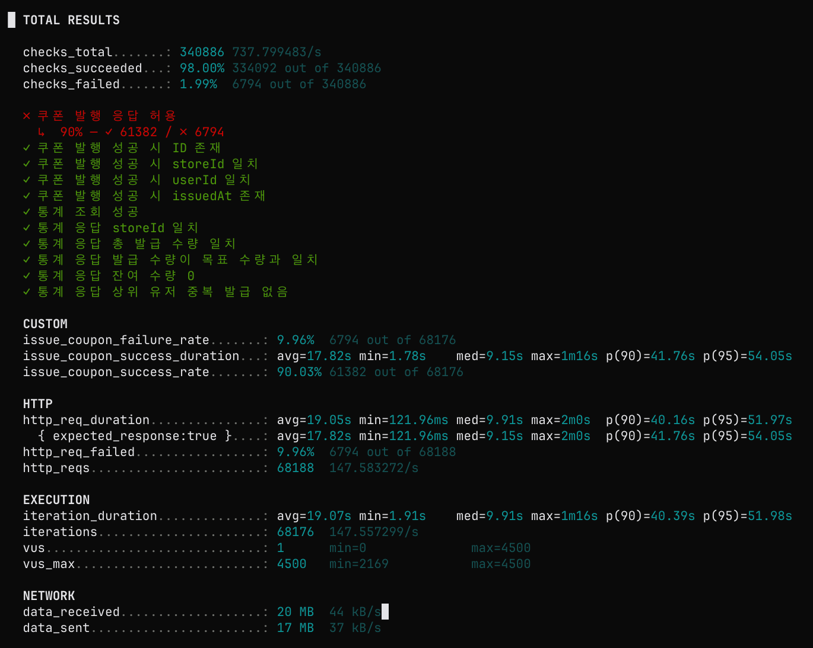
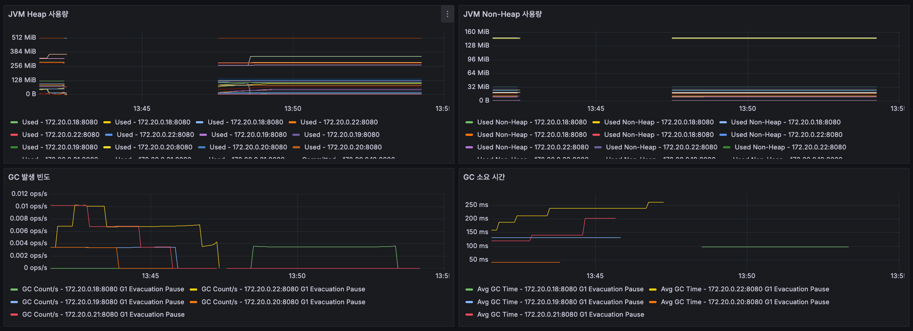
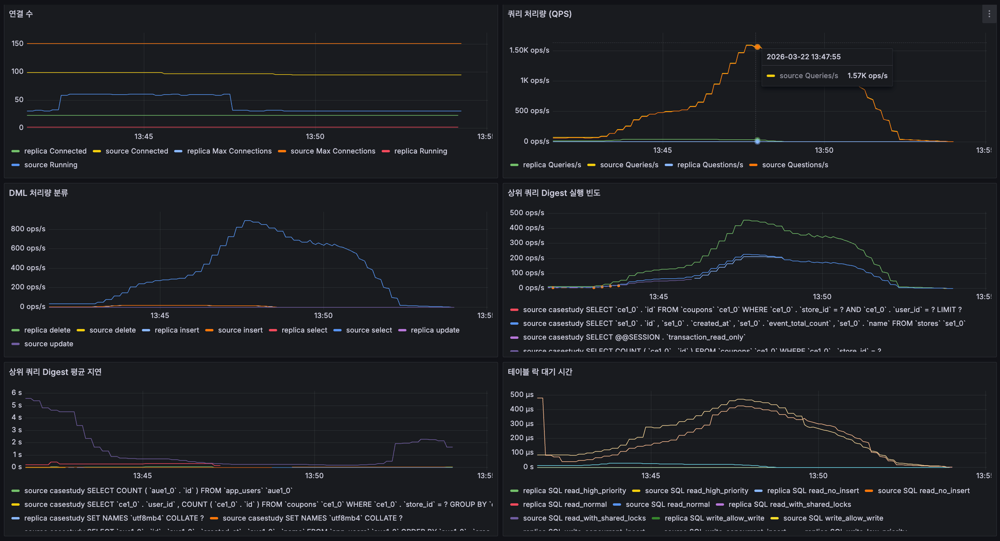

# 쇼핑몰 실시간 라이브 방송 - 쿠폰 발행 시나리오 

이 시나리오는 쇼핑몰 라이브 방송에서 사용자가 쿠폰 발행 버튼을 눌렀을 때, 쿠폰이 발행되는 과정을 시뮬레이션한다. 

- 가정
  - 사용자 수 : 20000명
  - 쿠폰 발행량 : 5000개
  - 인당 발행 제한 : 1개
  - 목표 응답 시간 : 500ms
  - 목표 QPS : 4500 req/s

[비관적락 테스트](#비관적-락-테스트-결과)를 진행했을 때 목표 QPS인 `4500 req/s`에 크게 못 미치는 결과가 나와서 이를 해결하기 위해서 Redis 락을 도입했다. 동일 유저 중복 조회 방지, Coupon 개수 정합성, 상점 이벤트 정보와 유저 정보 등을 Cache Aside 했음에도 목표 QPS 달성에는 실패했다. 

심지어 Redisson에서 Netty Connection Pool이 고갈되는 현상까지 발생해서 쿠폰 정합성이 맞지 않는 버그도 함께 발생했다. 이때는 실제로 두 종류의 문제가 겹쳐 있었다. 첫 번째는 `CouponRepository.save()` 이후 Redis에 해당 유저의 발급 여부를 기록하는 흐름이 트랜잭션으로 묶여 있지 않았다는 점이다. 그래서 `save()`는 성공했는데 Redis 기록 단계에서 예외가 발생하면 Fallback 로직을 타면서 DB에는 쿠폰이 저장됐지만 Redis에는 발급 기록이 남지 않을 수 있었고, 그 결과 캐시와 DB 사이 정합성이 깨졌다. 이 문제는 이후 `save + markCouponIssued`를 하나의 트랜잭션 경계로 묶으면서 해결했다.

두 번째는 초기 재고 적재 구간의 락 만료 경쟁 조건이었다. 초기에는 같은 유저에 대한 중복 발급을 의심했지만, `storeId + userId` 기준으로 집계했을 때 `count > 1`인 유저가 확인되지 않아 원인을 다시 추적했다. 조사 결과 동일 유저 중복 발급보다는 Redis에 남은 쿠폰 수량을 최초 적재하는 `initializeRemainingStockIfAbsent()` 구간에서 경쟁 조건이 발생했을 가능성이 더 높았다. 당시 구현은 고정 lease time 기반 락을 사용하고 있었는데, 이 락이 작업 중간에 만료되면 다른 트랜잭션이 아직 critical section 안에 여러 개 남아 있는 상태에서도 다시 초기화 로직에 진입할 수 있었다. 그 사이 재고가 `1000`으로 재적재된 뒤 각 요청이 다시 `-1` 감소를 수행하면서, 실제보다 더 높은 재고가 남아 있는 것처럼 측정되는 문제가 생겼다. 서로 다른 시점의 `issuedCount`를 기준으로 남은 재고가 중복 계산되거나 더 오래된 값이 마지막에 덮어써지면서 초과 발급 위험까지 커졌다. 이 문제는 [고정 lease time 대신 watchdog 기반 락으로 전환하고 unlock 시 현재 스레드 보유 여부를 확인하는 변경](https://github.com/rookedsysc/case-study/pull/3/changes/130f0cf0e17f1fbecf0c457df6603bc5555b0033)으로 완화했다.

즉 이 이슈는 단순한 중복 발급 문제가 아니라, DB/Redis 기록 순서 불일치와 재고 캐시 초기화 시점의 동시성 제어 실패가 결합된 복합 장애였다. 따라서 [문제를 근본적으로 해결하면서 Redisson 최적화를 시도](https://github.com/rookedsysc/case-study/pull/10/changes)했다.

## 비관적 락 테스트 결과

비관적 락 시나리오에서는 목표 QPS인 `4500 req/s`에 크게 못 미쳤고, 요청이 DB 구간에서 직렬화되면서 전체 처리량과 응답 시간이 빠르게 악화됐다.

### 결과 요약

- k6 기준 전체 요청 처리량은 약 `147.58 req/s`였고, 목표 QPS `4500 req/s` 대비 약 `3.3%` 수준에 머물렀다.
- iteration 처리량도 `147.56 it/s` 수준으로, 높은 동시성을 걸어도 실제 처리량이 거의 늘어나지 않았다.
- `issue_coupon_success_rate`는 `90.03%`였지만 `http_req_duration p(95)`는 `51.97s`, `issue_coupon_success_duration p(95)`는 `54.05s`로 목표 응답 시간 `500ms`를 크게 초과했다.
- 실패율은 `9.96%`였고, `쿠폰 발행 응답 허용` 체크도 `61,382 / 68,176`만 통과했다.
- JVM Heap은 인스턴스별로 대체로 `128MiB` 이하에서 유지됐고, 일부 인스턴스만 약 `256~320MiB` 수준까지 사용했다. GC 빈도는 높지 않았으며 평균 GC 시간도 대체로 `100~260ms` 범위에 머물렀다.
- DB는 replica보다 source에 부하가 집중됐고, source `Questions/s`가 최대 약 `1.57K ops/s`까지 상승했다. 상위 digest와 DML 분류를 보면 `coupons`, `stores`, `app_users` 조회가 반복되며 source select가 최대 `800 ops/s` 이상까지 치솟았다.
- 테이블 락 대기 시간은 source 기준 최대 약 `450us` 수준으로 아주 길지는 않았지만, 락 자체보다 반복적인 조회와 직렬화된 처리 경로가 병목으로 보였다.

### 관찰 이미지

캡션: k6 최종 결과 화면이다. 전체 요청 처리량이 약 `147.58 req/s`에 머물고 `http_req_duration p(95)`가 `51.97s`까지 올라가면서, 목표 QPS `4500 req/s`와 목표 응답 시간 `500ms`를 모두 만족하지 못한 것을 보여준다.

캡션: 애플리케이션 JVM 메트릭 화면이다. Heap과 Non-Heap 사용량은 전체적으로 안정적이고 GC 빈도도 높지 않아서, 이 시나리오의 주된 병목이 JVM 메모리 압박보다는 다른 구간에 있음을 시사한다.

캡션: 데이터베이스 관측 화면이다. source DB에 연결과 쿼리가 집중되고 `coupons`, `stores`, `app_users` 관련 조회가 반복적으로 증가하면서, 비관적 락 기반 처리에서 DB 직렬화 비용이 병목으로 작용했음을 보여준다.

### 해석

비관적 락은 메모리나 GC보다 DB 중심의 동시성 제어 비용이 더 크게 드러났다. 애플리케이션 자체가 메모리 압박으로 무너진 것은 아니지만, source DB에 쿼리와 락 관련 작업이 몰리면서 요청 하나당 대기 시간이 길어졌고, 그 결과 전체 QPS와 응답 시간이 모두 목표 수준에 도달하지 못했다.
