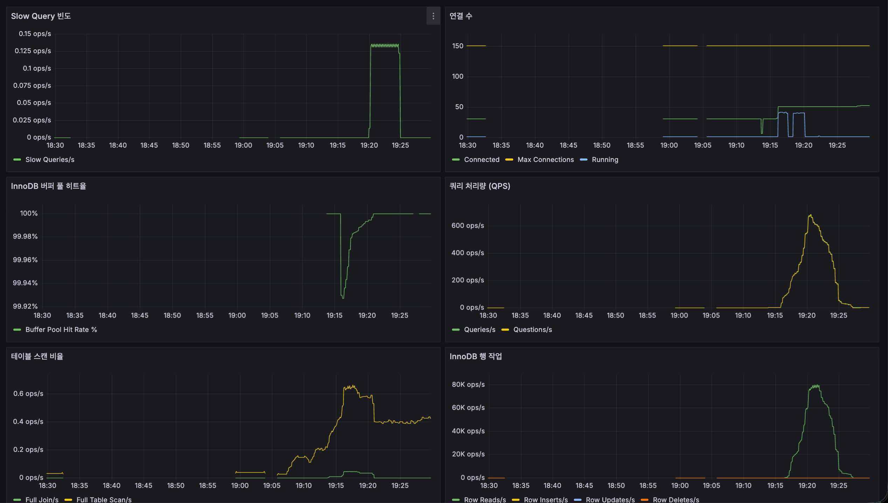
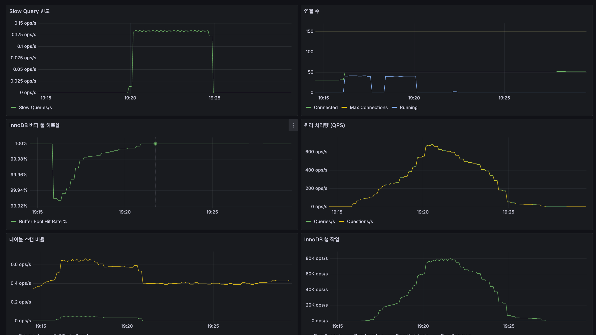
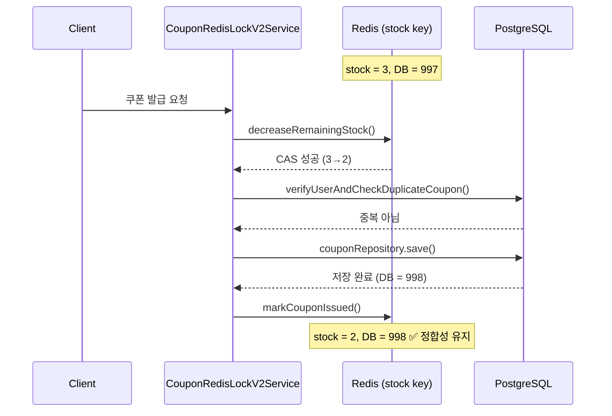
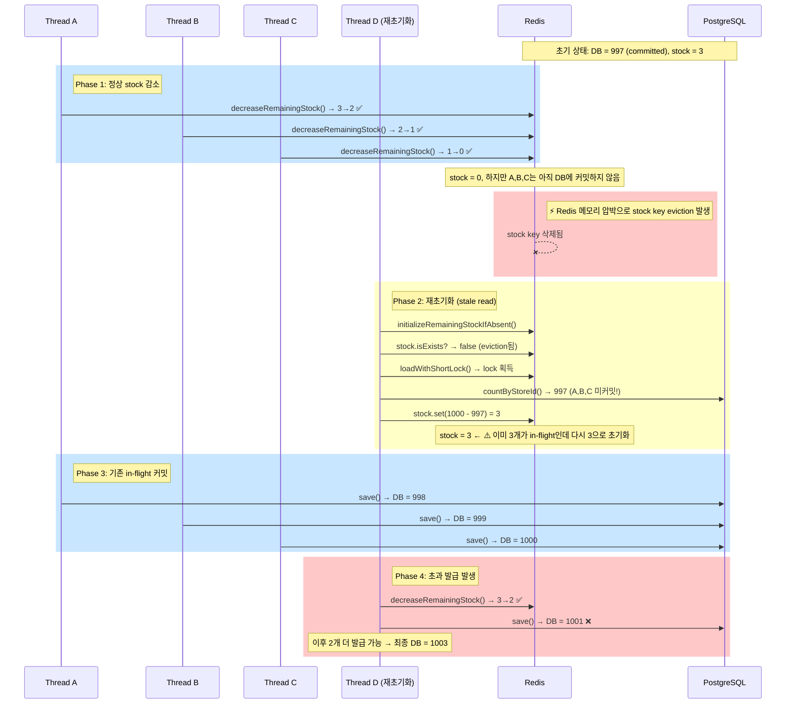
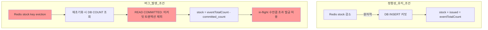
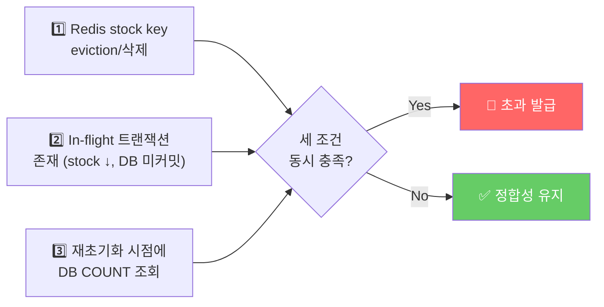

# 쇼핑몰 실시간 라이브 방송 - 쿠폰 발행 시나리오 

이 시나리오는 쇼핑몰 라이브 방송에서 사용자가 쿠폰 발행 버튼을 눌렀을 때, 쿠폰이 발행되는 과정을 시뮬레이션한다. 

- 가정
  - 사용자 수 : 10000명
  - 쿠폰 발행량 : 1000개
  - 인당 발행 제한 : 1개
  - 인당 발행 시도 횟수 : 10회
  - 목표 QPS : 5분에 10000 * 10

## 비관적 락 테스트 결과

`coupon-only-load.js` 기준으로 쿠폰 발행 API의 `issue_coupon_pessimistic_lock` 시나리오를 측정했다.

### 결과 요약

- `http_req_duration{phase:measure,kind:issue_coupon_pessimistic_lock}` 의 `p(95)` 는 `50.47s` 로, 임계값 `500ms` 를 크게 초과했다.
- `http_req_failed{phase:measure,kind:issue_coupon_pessimistic_lock}` 실패율은 `72.77%` 로, 목표 임계값 `1%` 를 만족하지 못했다.
- 쿠폰 발행 응답 허용 체크 성공률은 `24%` (`19,646 / 80,981`) 수준이었다.
- 전체 HTTP 처리량은 `190.17 req/s`, iteration 처리량은 `89.70 it/s` 였다.
- `iteration_duration` 의 `p(95)` 는 `2m 49s` 로 측정되어 요청 단위뿐 아니라 전체 실행 시간도 크게 증가했다.

### 상세 지표

```text
THRESHOLDS

http_req_duration{phase:measure,kind:issue_coupon_pessimistic_lock}
✗ 'p(95) < 500' p(95)=50.47s

http_req_failed{phase:measure,kind:issue_coupon_pessimistic_lock}
✗ 'rate < 0.01' rate=72.77%

TOTAL RESULTS

checks_total.......: 244074 538.794638/s
checks_succeeded...: 74.87% 182739 out of 244074
checks_failed......: 25.12% 61335 out of 244074

쿠폰 발행 응답 허용: 24% — 19646 / 61335
쿠폰 발행 성공 시 ID 존재: 성공
쿠폰 발행 성공 시 storeId 일치: 성공
쿠폰 발행 성공 시 userId 일치: 성공
쿠폰 발행 성공 시 issuedAt 존재: 성공

http_req_duration........................................: avg=8.08s  min=0s     med=65.84ms max=2m12s p(90)=28.93s p(95)=50.47s
  { expected_response:true }.............................: avg=20.22s min=3.88ms med=20.25s  max=2m12s p(90)=35.59s p(95)=45.4s
  { phase:measure,kind:issue_coupon_pessimistic_lock }...: avg=8.08s  min=0s     med=65.71ms max=2m12s p(90)=28.93s p(95)=50.47s
http_req_failed..........................................: 72.76% 62687 out of 86145
  { phase:measure,kind:issue_coupon_pessimistic_lock }...: 72.77% 62687 out of 86134
http_reqs................................................: 86145 190.16554/s

iteration_duration.......................................: avg=1m28s  min=1.22ms med=1m9s    max=3m59s p(90)=2m40s p(95)=2m49s
iterations...............................................: 40632 89.695354/s
vus......................................................: 297   min=0     max=73240
vus_max..................................................: 100000 min=14331 max=100000

data_received............................................: 7.2 MB 16 kB/s
data_sent................................................: 11 MB 25 kB/s
```

### 해석

- 비관적 락 경쟁이 심해지면서 상당수 요청이 실패했고, 성공 요청조차 응답 시간이 길게 늘어났다.
- 중앙값은 비교적 낮지만 `p(90)` 과 `p(95)` 가 급격히 증가해 긴 꼬리 지연이 매우 큰 상태다.
- 임계값 두 개가 모두 실패했고 전체 실패율도 높아 현재 조건에서는 안정적인 쿠폰 발행 처리로 보기 어렵다.

### 결과 이미지

#### 애플리케이션 지표



#### DB 지표



### 후속 확인 포인트

- 실패 요청의 실제 상태 코드와 예외 유형을 애플리케이션 로그에서 우선 확인한다.
- DB 락 대기 시간, 커넥션 풀, 스레드 풀 고갈 여부를 함께 점검한다.
- VU 증가 구간별로 응답 시간과 실패율이 어떻게 악화되는지 단계적으로 재측정한다.

## Redis 락 테스트 결과

첫 번째 Redis 락 측정 결과로 `coupon-only-load.js` 기준 `issue_coupon_redis_lock` 시나리오를 기록한다.

### 결과 요약

- `http_req_duration{phase:measure,kind:issue_coupon_redis_lock}` 의 `p(95)` 는 `58.3s` 로, 목표 응답 시간 관점에서 매우 큰 지연이 발생했다.
- `http_req_failed{phase:measure,kind:issue_coupon_redis_lock}` 실패율은 `58.34%` 로, 전체 요청의 절반 이상이 실패했다.
- 쿠폰 발행 응답 허용 체크 성공률은 `40%` (`16,504 / 40,484`) 였다.
- 통계 조회 자체는 성공했지만 실제 발급 수량이 목표 수량에 도달하지 못했고 잔여 수량도 `0` 이 되지 않았다.
- 전체 HTTP 처리량은 `109.45 req/s`, iteration 처리량은 `62.91 it/s` 였다.

### 상세 지표

```text
checks_total................................: 94496  251.604925/s
checks_succeeded............................: 74.62% 70513 out of 94496
checks_failed...............................: 25.37% 23983 out of 94496

쿠폰 발행 응답 허용
  ↳  40% — ✓ 16504 / ✗ 23980
쿠폰 발행 성공 시 ID 존재: 성공
쿠폰 발행 성공 시 storeId 일치: 성공
쿠폰 발행 성공 시 userId 일치: 성공
쿠폰 발행 성공 시 issuedAt 존재: 성공
통계 조회 성공: 성공
통계 응답 storeId 일치: 성공
통계 응답 총 발급 수량 일치: 성공
통계 응답 발급 수량이 목표 수량과 일치
  ↳  0% — ✓ 0 / ✗ 1
통계 응답 잔여 수량 0
  ↳  0% — ✓ 0 / ✗ 1
통계 응답 상위 유저 중복 발급 없음: 성공

http_req_duration..................................: avg=14.23s min=0s     med=3.46s max=2m15s p(90)=53.9s  p(95)=58.3s
  { expected_response:true }.......................: avg=20.13s min=6.95ms med=11.6s max=2m7s  p(90)=47.54s p(95)=54.18s
  { phase:measure,kind:issue_coupon_redis_lock }..: avg=14.24s min=0s     med=3.47s max=2m15s p(90)=53.9s  p(95)=58.3s
http_req_failed....................................: 58.33% 23981 out of 41112
  { phase:measure,kind:issue_coupon_redis_lock }..: 58.34% 23981 out of 41100
http_reqs..........................................: 41112  109.449728/s

iteration_duration.................................: avg=3m17s  min=1.62ms med=4m31s max=5m54s p(90)=5m12s  p(95)=5m47s
iterations.........................................: 23629  62.905906/s
vus................................................: 0      min=0              max=35036
vus_max............................................: 100000 min=12347          max=100000

data_received......................................: 5.8 MB 15 kB/s
data_sent..........................................: 7.3 MB 19 kB/s
```

### 해석

- Redis 락을 사용해도 높은 동시성 구간에서 실패율이 크게 발생해 안정적인 발급 보장이 되지 않았다.
- 성공 요청만 보더라도 `p(95)` 가 `54.18s` 로 길어, 락 경합 또는 후속 처리 병목이 크게 나타난다.
- 통계 검증에서 목표 수량 미달과 잔여 수량 불일치가 발생해, 요청 실패가 최종 집계 결과에도 직접 영향을 준 것으로 보인다.

## Cache-Aside 적용 Redis 락 테스트 결과

`coupon-only-load.js` 기준으로 `user`, `store`, `couponCount` 를 cache-aside 패턴으로 캐싱한 뒤 `issue_coupon_redis_lock_v2` 시나리오를 측정했다.

### 결과 요약

- `http_req_duration{phase:measure,kind:issue_coupon_redis_lock_v2}` 의 `p(95)` 는 `33.65s` 로, 기존 Redis 락 측정값 `58.3s` 대비 개선됐다.
- `http_req_failed{phase:measure,kind:issue_coupon_redis_lock_v2}` 실패율은 `50.26%` 로 여전히 높지만, 기존 Redis 락 결과 `58.34%` 보다는 낮아졌다.
- 쿠폰 발행 응답 허용 체크 성공률은 `58%` (`42,328 / 72,059`) 로, 기존 `40%` 대비 개선됐다.
- 전체 HTTP 처리량은 `239.03 req/s`, iteration 처리량은 `202.34 it/s` 로 증가했다.
- 다만 통계 검증에서는 실제 발급 수량이 목표 수량에 도달하지 못했고 잔여 수량도 `0` 이 되지 않았다.

### 상세 지표

```text
쿠폰 발행 응답 허용
  ↳  58% — ✓ 42328 / ✗ 29731
✓ 쿠폰 발행 성공 시 ID 존재
✓ 쿠폰 발행 성공 시 storeId 일치
✓ 쿠폰 발행 성공 시 userId 일치
✓ 쿠폰 발행 성공 시 issuedAt 존재
✓ 통계 조회 성공
✓ 통계 응답 storeId 일치
✓ 통계 응답 총 발급 수량 일치
✗ 통계 응답 발급 수량이 목표 수량과 일치
  ↳  0% — ✓ 0 / ✗ 1
✗ 통계 응답 잔여 수량 0
  ↳  0% — ✓ 0 / ✗ 1
✓ 통계 응답 상위 유저 중복 발급 없음

HTTP
http_req_duration.....................................: avg=8.08s  min=0s     med=2.19s  max=1m23s p(90)=24.78s p(95)=33.65s
  { expected_response:true }..........................: avg=15.31s min=4.02ms med=13.38s max=1m23s p(90)=33.48s p(95)=38.34s
  { phase:measure,kind:issue_coupon_redis_lock_v2 }...: avg=8.08s  min=0s     med=2.19s  max=1m23s p(90)=24.78s p(95)=33.65s
http_req_failed.......................................: 50.26% 42783 out of 85123
  { phase:measure,kind:issue_coupon_redis_lock_v2 }...: 50.26% 42783 out of 85111
http_reqs.............................................: 85123  239.029338/s

EXECUTION
iteration_duration....................................: avg=1m31s  min=301µs  med=1m28s  max=5m1s  p(90)=3m6s   p(95)=3m13s
iterations............................................: 72057  202.339403/s
vus...................................................: 0      min=0              max=33304
vus_max...............................................: 100000 min=13230          max=100000

NETWORK
data_received.........................................: 12 MB  34 kB/s
data_sent.............................................: 14 MB  38 kB/s
```

### 해석

- cache-aside 로 조회성 데이터 접근을 줄이면서 처리량과 응답 시간이 모두 개선됐고, 특히 `p(95)` 와 iteration 처리량에서 차이가 크게 나타났다.
- 그럼에도 실패율이 여전히 `50%` 수준이라 락 경합 자체나 쿠폰 발급 후속 처리 구간의 병목은 남아 있는 것으로 보인다.
- 통계 검증이 여전히 실패한 점을 보면, 캐시 적용만으로는 목표 수량만큼의 발급 완료를 보장하지 못했고 최종 일관성 문제도 해결되지 않았다.

## Full Cache + 최소 DB 접근 Redis 락 테스트 결과

Redis에 모든 조회 데이터를 캐싱하고, 캐시 미스 시에도 DB 접근 쿼리 수를 최소화한 뒤 `issue_coupon_redis_lock_v2` 시나리오를 측정했다.

### 결과 요약

- `http_req_duration{phase:measure,kind:issue_coupon_redis_lock_v2}` 의 `p(95)` 는 `21.85s` 로, Cache-Aside 적용 결과 `33.65s` 대비 개선됐다.
- `http_req_failed{phase:measure,kind:issue_coupon_redis_lock_v2}` 실패율은 `29.44%` 로, 이전 단계 `50.26%` 에서 크게 낮아졌다.
- 쿠폰 발행 응답 허용 체크 성공률은 `49%` (`19,519 / 39,174`) 였다.
- **통계 검증 항목이 모두 통과했다.** 발급 수량이 목표 수량과 일치하고 잔여 수량도 `0` 으로 확인됐다.
- 전체 HTTP 처리량은 `144.67 req/s`, iteration 처리량은 `38.65 it/s` 였다.

### 상세 지표

```text
TOTAL RESULTS

✗ 쿠폰 발행 응답 허용
  ↳  49% — ✓ 19519 / ✗ 19655
✓ 쿠폰 발행 성공 시 ID 존재
✓ 쿠폰 발행 성공 시 storeId 일치
✓ 쿠폰 발행 성공 시 userId 일치
✓ 쿠폰 발행 성공 시 issuedAt 존재
✓ 통계 조회 성공
✓ 통계 응답 storeId 일치
✓ 통계 응답 총 발급 수량 일치
✓ 통계 응답 발급 수량이 목표 수량과 일치
✓ 통계 응답 잔여 수량 0
✓ 통계 응답 상위 유저 중복 발급 없음

HTTP
http_req_duration.....................................: avg=5.32s  min=0s     med=1.18s  max=1m12s p(90)=18.28s p(95)=21.85s
  { expected_response:true }..........................: avg=7.36s  min=3.41ms med=2.8s   max=1m12s p(90)=20.16s p(95)=23.34s
  { phase:measure,kind:issue_coupon_redis_lock_v2 }...: avg=5.32s  min=0s     med=1.18s  max=1m12s p(90)=18.28s p(95)=21.85s
http_req_failed.......................................: 29.43% 19676 out of 66839
  { phase:measure,kind:issue_coupon_redis_lock_v2 }...: 29.44% 19676 out of 66827
http_reqs.............................................: 66839  144.67097/s

EXECUTION
iteration_duration....................................: avg=28.94s min=5.63ms med=26.19s max=1m1s  p(90)=51.42s p(95)=52.87s
iterations............................................: 17857  38.65093/s
vus...................................................: 0      min=0              max=93470
vus_max...............................................: 100000 min=13861          max=100000

NETWORK
data_received.........................................: 14 MB  29 kB/s
data_sent.............................................: 13 MB  29 kB/s
```

### 해석

- DB 접근을 최소화하면서 응답 시간과 실패율이 모두 개선됐고, 특히 `p(95)` 가 `33.65s → 21.85s`, 실패율이 `50.26% → 29.44%` 로 낮아졌다.
- 이전 단계까지 실패하던 통계 검증(발급 수량 목표 일치, 잔여 수량 0)이 이번 테스트에서 처음으로 모두 통과했다. 캐시 계층을 통한 조회 부하 감소가 최종 정합성에도 긍정적인 영향을 준 것으로 보인다.
- 다만 쿠폰 발행 응답 허용 성공률은 `49%` 수준으로 아직 절반 정도에 머물러 있어, 락 경합 구간의 병목은 여전히 남아 있다.

## Redisson 전환 후 Redis 락 테스트 결과

Redisson API로 Redis 락을 완전 대체한 뒤 `issue_coupon_redis_lock_v2` 시나리오를 측정했다.

### 결과 요약

- `http_req_duration{phase:measure,kind:issue_coupon_redis_lock_v2}` 의 `p(95)` 는 `32.5s` 로, Full Cache 단계 `21.85s` 대비 증가했다.
- `http_req_failed{phase:measure,kind:issue_coupon_redis_lock_v2}` 실패율은 `38.41%` 로, Full Cache 단계 `29.44%` 보다 높아졌다.
- 쿠폰 발행 응답 허용 체크 성공률은 `58%` (`25,007 / 42,826`) 로, Full Cache 단계 `49%` 대비 개선됐다.
- **통계 검증 항목이 모두 통과했다.** 발급 수량이 목표 수량과 일치하고 잔여 수량도 `0` 으로 확인됐다.
- 전체 HTTP 처리량은 `129.20 req/s`, iteration 처리량은 `46.34 it/s` 였다.
- `쿠폰 발행 성공 시 userId 일치` 체크에서 `99%` (1건 실패)가 기록됐으나, 단발성 이상으로 판단된다.

### 상세 지표

```text
TOTAL RESULTS

✗ 쿠폰 발행 응답 허용
  ↳  58% — ✓ 25007 / ✗ 17819
✓ 쿠폰 발행 성공 시 ID 존재
✓ 쿠폰 발행 성공 시 storeId 일치
✗ 쿠폰 발행 성공 시 userId 일치
  ↳  99% — ✓ 19391 / ✗ 1
✓ 쿠폰 발행 성공 시 issuedAt 존재
✓ 통계 조회 성공
✓ 통계 응답 storeId 일치
✓ 통계 응답 총 발급 수량 일치
✓ 통계 응답 발급 수량이 목표 수량과 일치
✓ 통계 응답 잔여 수량 0
✓ 통계 응답 상위 유저 중복 발급 없음

HTTP
http_req_duration.....................................: avg=10.04s min=0s     med=5.19s  max=2m50s p(90)=26.44s p(95)=32.5s
  { expected_response:true }..........................: avg=15.25s min=4.94ms med=12.07s max=2m50s p(90)=31.83s p(95)=33.36s
  { phase:measure,kind:issue_coupon_redis_lock_v2 }...: avg=10.04s min=0s     med=5.2s   max=2m50s p(90)=26.44s p(95)=32.5s
http_req_failed.......................................: 38.41% 18239 out of 47477
  { phase:measure,kind:issue_coupon_redis_lock_v2 }...: 38.42% 18239 out of 47465
http_reqs.............................................: 47477  129.202311/s

EXECUTION
iteration_duration....................................: avg=1m50s  min=4.17ms med=47.11s max=5m49s p(90)=4m56s  p(95)=5m0s
iterations............................................: 17027  46.336705/s
vus...................................................: 0      min=0              max=37388
vus_max...............................................: 100000 min=9762           max=100000

NETWORK
data_received.........................................: 8.5 MB 23 kB/s
data_sent.............................................: 8.9 MB 24 kB/s
```

### 해석

- Redisson 전환 이후 통계 검증은 모두 통과해 최종 정합성은 유지됐다.
- 응답 시간(`p(95)` 32.5s)과 실패율(38.41%)이 Full Cache 단계보다 소폭 증가했는데, 이는 락 구현 방식 변경에 따른 경합 패턴 차이로 보인다.
- 쿠폰 발행 응답 허용 성공률이 `49% → 58%` 로 올랐고, 여전히 락 경합 구간의 병목은 남아 있다.
- `userId 일치` 체크 1건 실패는 단발성으로 보이며, 락 전환 자체의 구조적 문제로 보기 어렵다.

## Redis 캐시 Jitter 적용 테스트 결과

캐시 만료 시점에 Jitter를 추가해 Cache Stampede를 방지한 뒤 `issue_coupon_redis_lock_v2` 시나리오를 측정했다.

### 결과 요약

- `http_req_duration{phase:measure,kind:issue_coupon_redis_lock_v2}` 의 `p(95)` 는 `30.92s` 로, Redisson 전환 단계 `32.5s` 대비 소폭 개선됐다.
- `http_req_failed{phase:measure,kind:issue_coupon_redis_lock_v2}` 실패율은 `36.09%` 로, Redisson 단계 `38.41%` 보다 낮아졌다.
- 쿠폰 발행 응답 허용 체크 성공률은 `56%` (`18,955 / 33,504`) 였다.
- **통계 검증 항목이 모두 통과했다.** 발급 수량이 목표 수량과 일치하고 잔여 수량도 `0` 으로 확인됐다.
- 전체 HTTP 처리량은 `84.63 req/s`, iteration 처리량은 `13.28 it/s` 였다.

### 상세 지표

```text
TOTAL RESULTS

✗ 쿠폰 발행 응답 허용
  ↳  56% — ✓ 18955 / ✗ 14549
✓ 쿠폰 발행 성공 시 ID 존재
✓ 쿠폰 발행 성공 시 storeId 일치
✓ 쿠폰 발행 성공 시 userId 일치
✓ 쿠폰 발행 성공 시 issuedAt 존재
✓ 통계 조회 성공
✓ 통계 응답 storeId 일치
✓ 통계 응답 총 발급 수량 일치
✓ 통계 응답 발급 수량이 목표 수량과 일치
✓ 통계 응답 잔여 수량 0
✓ 통계 응답 상위 유저 중복 발급 없음

HTTP
http_req_duration.....................................: avg=8.55s  min=0s     med=2.16s max=4m45s p(90)=28.09s p(95)=30.92s
  { expected_response:true }..........................: avg=12.28s min=1.82ms med=5.88s max=4m44s p(90)=29.25s p(95)=33.23s
  { phase:measure,kind:issue_coupon_redis_lock_v2 }...: avg=8.55s  min=0s     med=2.16s max=4m45s p(90)=28.09s p(95)=30.92s
http_req_failed.......................................: 36.09% 18629 out of 51610
  { phase:measure,kind:issue_coupon_redis_lock_v2 }...: 36.10% 18629 out of 51598
http_reqs.............................................: 51610  84.632505/s

EXECUTION
iteration_duration....................................: avg=14.13s min=3.92ms med=8.53s max=4m43s p(90)=31.47s p(95)=32.33s
iterations............................................: 8098   13.279481/s
vus...................................................: 0      min=0              max=50522
vus_max...............................................: 100000 min=14043          max=100000

NETWORK
data_received.........................................: 9.6 MB 16 kB/s
data_sent.............................................: 10 MB  17 kB/s
```

### 해석

- Jitter 적용으로 캐시 만료 집중 현상이 완화되면서 응답 시간(`p(95)` 32.5s → 30.92s)과 실패율(38.41% → 36.09%)이 소폭 개선됐다.
- 통계 검증은 모두 통과해 최종 정합성은 유지됐다.
- 쿠폰 발행 응답 허용 성공률은 `56%` 로 Redisson 단계 `58%` 대비 소폭 낮아졌으나, 전반적인 실패율 개선과 정합성 유지를 고려하면 Jitter 적용의 효과는 긍정적이다.
- 락 경합 구간의 병목은 여전히 남아 있어 추가적인 개선 여지가 있다.
## In-Flight Race Condition 분석: 쿠폰 초과 발급 (1003/1000)

`withUserLock` 제거 후 테스트에서 쿠폰이 1000개 제한인데 1003개가 발급되는 데이터 정합성 버그가 발생했다.
원인은 **Redis stock key eviction + in-flight 트랜잭션의 DB 미반영**이 결합된 race condition이다.

### 정상 흐름

정상적인 쿠폰 발급 흐름에서는 Redis stock이 재고를 원자적으로 관리한다.



### 버그 시나리오: Stock Key Eviction + In-Flight 트랜잭션

핵심은 `initializeRemainingStockIfAbsent`가 DB의 `countByStoreId`로 재고를 재초기화할 때,
**아직 커밋되지 않은 in-flight 트랜잭션을 반영하지 못한다**는 것이다.



### 왜 이런 일이 발생하는가?

문제의 근본 원인은 **두 가지 시스템 간의 일관성 단절**이다.



### 원인 코드 분석

`CouponRedisCoordinator.kt`의 `initializeRemainingStockIfAbsent`:

```kotlin
private fun initializeRemainingStockIfAbsent(storeId, eventTotalCount, issuedCountLoader) {
    val stock = redissonClient.getAtomicLong(stockKey(storeId))
    loadWithShortLock(
        lockKey = stockInitializationLockKey(storeId),
        readCached = { if (stock.isExists) true else null },  // key가 eviction되면 false
        loadAndCache = {
            val issuedCount = issuedCountLoader()             // ← READ COMMITTED만 반영
            stock.set((eventTotalCount - issuedCount).coerceAtLeast(0L))  // ← stale count로 초기화
            true
        },
    )
}
```

| 취약점 | 설명 |
|--------|------|
| `stock key에 TTL 없음` | Redis 메모리 압박 시 LRU eviction 대상이 됨 |
| `issuedCountLoader`가 READ COMMITTED | 아직 커밋되지 않은 in-flight 트랜잭션의 쿠폰을 세지 못함 |
| `stock 감소 ↔ DB 커밋 사이의 gap` | 이 구간에서 재초기화가 발생하면 stock이 실제보다 높게 설정됨 |

### 발생 조건 정리

이 버그가 발생하려면 **세 가지 조건이 동시에 충족**되어야 한다.



### 참고: 초과 발급 수량 공식

초과 발급 수량은 **재초기화 시점의 in-flight 트랜잭션 수**와 정확히 일치한다.

```
초과_발급_수 = 재초기화_시점_in_flight_count
실제_발급_수 = eventTotalCount + in_flight_count
```

이번 케이스에서 `1003 - 1000 = 3`, 즉 재초기화 시점에 3개의 트랜잭션이 in-flight 상태였다.
